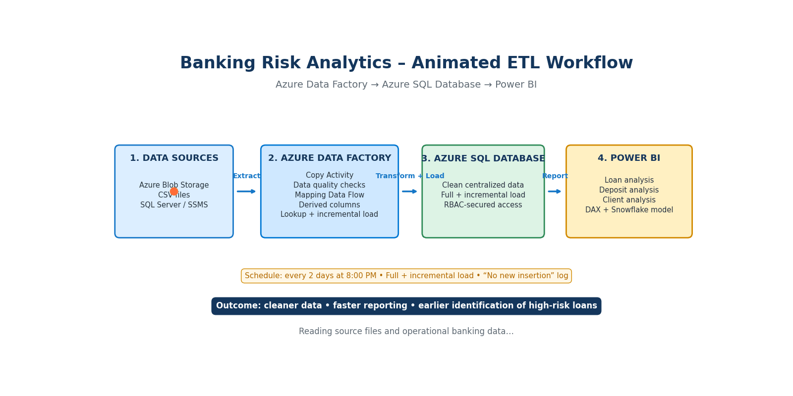

# Banking Risk Analytics

## Project Overview

An end-to-end banking analytics solution built using Azure Data Factory, Azure SQL Database, and Power BI.

## Project Workflow

## Technologies Used

- Azure Data Factory
- Azure SQL Database
- Power BI
- SQL Server / SSMS
- Azure Blob Storage
- DAX

## ETL Process

Azure Blob Storage → Azure Data Factory
→ Azure SQL Database → Power BI

## Key Features

- Full and incremental data load
- Data cleaning and transformation
- Business logic and derived columns
- Interactive Power BI dashboards
- Loan, Deposit, and Client analysis
